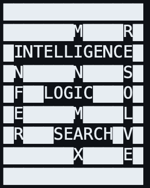
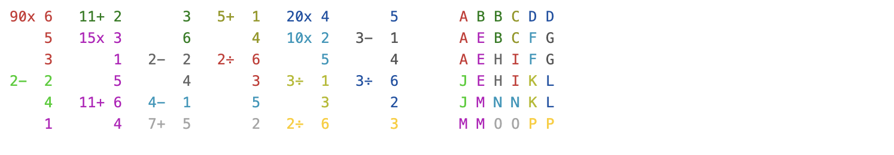

## Python Operator Overload Challenge (with kenken): 
### **Extracting a solution from one problem by using the solution code of another.**
Applying multiple student solutions to a well-known CS50AI crossword problem to solve kenken. 


  

Here we craft custom classes that allow kenken to use existing crossword solving algorithms through operator overloading.

### Background
This project is a riff on a project from Harvard's online course, *CS50: Introduction to Artificial Intelligence*.  The algorithm takes a blank puzzle structure and a vocabulary and fills in words in a way that is crossword-compatible.  Students were challenged to complete unimplemented methods of `class CrosswordCreator`.  A separate file contains two custom classes describing the layout of a generic crossword puzzle. 

#### **The generic algorithms students are challenged to recreate are not new:**
- ac3 (1977)
- Backtrack search (1950's, likely earlier)

The sane approach is first to create generic ac3 and backtrack algorithms first. For example, showing only the `ac3()`):

<div style="font-size: 10px;">

```python
class Solver:
  def __init__(self, csp):
    ...

  def ac3(csp:CSP):
      ''' generic ac3 algorithm '''

      def revise(xi, xj):
        revised = False
        for x in csp.domains[xi]:
            ## In the CS50 problem, CSP.is_consistent() is not a valid method and students are not able
            # to make changes to the CSP class definition. This makes our problem more difficult.
            if not any(csp.is_consistent(xi, x, xj, y) for y in csp.domains[xj]):
                csp.domains[xi].remove(x)
                revised = True
        return revised
      ### --- END revised()--- ###
        
      queue = list(csp.constraints)
      while queue:
          (xi, xj) = queue.pop(0)
          if revise(csp, xi, xj):
              if len(csp.domains[xi]) == 0:
                  return False
              for xk in csp.neighbors[xi] - {xj}:
                  queue.append((xk, xi))
      return True

  ```
</div>

**Our challenge is not the algorihm but to hack the *CS50* assignment itself:** To build a custom Kenken solver that works with any student implementation.  Our solution must be *implementation-agnostic*.  But CS50 does not set up the algorithms in a generic way:

1. The CS50 solver, `CrosswordCreator` constructs the `csp.domains` rather than accept them from the original `csp` (`crossword`) object. And so the student must enforce the node consistency inside the solver in his/her own way:

<div style="font-size: 10px;">  

```python
class CrosswordCreator:
    def __init__(self, crossword):
        ...
        self.domains = { var: self.crossword.words.copy()
                            for var in self.crossword.variables}
```
</div>

2. The CSP class has no `.is_consistent()` method, forcing the student to implement its logic inside the solver itself.
    
** The effect of these two differences is to make their solutions far from generic.** 

#### One rule: Do not modify the students' algorithms.
For a method to be *implementation-agnostic*, it should work with any student's successful implementation of the crossword problem.

#### General approach
The *CS50* source code uses the traditional class name `Variable` to represent a crossword slot (e.g., #3 down, or #4 across, etc.).  A `Crossword` class instance is a collection of `Variable` objects that make up the puzzle. For Kenken, I  created `Cage` and `Kenken` classes to mirror the implementation. To illustrate the general principle with python's `typing` module, any of the solution's constituent functions (here, `func`) must be able to produce the correct effect on both crossword and kenken.  

Example:
<div style="font-size: 10px;">

```python
from typing import Dict, Set, Vector, Tuple, overload
from crossword import Variable, Crossword   # fixed code provided to students
from kenken import Cage, Kenken  # my custom code describing kenken

# it should work for kenken...
@overload  
def func(x: Cage, y: Cage, domains: Dict[Cage, Set[Vector]], overlaps: Overlaps):
    ...

# ... if it works for crossword.
def func(x: Variable, y: Variable, domains: Dict[Variable, Set[str]], 
      overlaps: Dict[Tuple[Variable, Variable], Tuple[int, int]]):
    raise NotImplementedError
```

</div>

#### Did it work?  Yes. But not always. A subtle but substantial error.
I sampled multiple published solutions to the *CS50* crossword project.  To be solution-agnostic, we consider all possible ways students might approach this problem. While the *Zen of Python* reads:  *"There should be one-- and preferably only one --obvious way to do it,"* the *CS50AI* students showed remarkable diversity in their approaches.

##### Where / when / how did it fail?
A surprisingly high rate students (of my sample, 4 out of 6) *didn't actually implement the `ac3` algorithm correctly* for the original *CS50* problem.  Rather than analyzing their code, I looked at the results.  I built a simple `ac3` test to wrap their solutions (see `ac3_test.ipynb`) to analyze students' `ac3` results:

<div style="font-size: 10px;">

```python

# Words remaining in each variable domain after applying ac3()
Puzzle 0
pcoster       :[1, 1, 1, 1] :[passed]  (elapsed: 0.1037 milliseconds)
verano_20     :[1, 1, 1, 1] :[passed]  (elapsed: 0.0865 milliseconds)
hadeeer98     :[1, 1, 2, 1] :[failed]  (elapsed: 0.0849 milliseconds)
chezslice     :[3, 4, 3, 3] :[failed]  (elapsed: 0.0455 milliseconds)
marcoshernanz :[1, 1, 2, 1] :[failed]  (elapsed: 0.0689 milliseconds)
iron8kid      :[3, 4, 3, 3] :[failed]  (elapsed: 0.2465 milliseconds)

Puzzle 1
pcoster       :[1, 2, 1, 1, 1, 2] :[passed]  (elapsed: 0.2108 milliseconds)
verano_20     :[1, 2, 1, 1, 1, 2] :[passed]  (elapsed: 0.2642 milliseconds)
hadeeer98     :[1, 2, 1, 1, 1, 2] :[passed]  (elapsed: 0.2122 milliseconds)
chezslice     :[5, 5, 10, 4, 10, 5] :[failed]  (elapsed: 0.0908 milliseconds)
marcoshernanz :[1, 2, 1, 1, 1, 2] :[passed]  (elapsed: 0.1590 milliseconds)
iron8kid      :[5, 5, 10, 4, 10, 5] :[failed]  (elapsed: 0.5960 milliseconds)

Puzzle 2
pcoster       :[414, 500, 500, 382, 490, 169] :[passed]  (elapsed: 135.5505 milliseconds)
verano_20     :[414, 500, 500, 382, 490, 169] :[passed]  (elapsed: 982.2309 milliseconds)
hadeeer98     :[414, 502, 502, 382, 490, 169] :[failed]  (elapsed: 305.6815 milliseconds)
chezslice     :[491, 502, 502, 483, 502, 174] :[failed]  (elapsed: 2.2414 milliseconds)
marcoshernanz :[414, 502, 502, 382, 490, 169] :[failed]  (elapsed: 12.1646 milliseconds)
iron8kid      :[491, 502, 502, 483, 502, 174] :[failed]  (elapsed: 272.9518 milliseconds)

Size of variable domains after ac3()
Puzzle 0
pcoster       :[1, 1, 1, 1] :[passed]  (elapsed: 0.0708 milliseconds)
verano_20     :[1, 1, 1, 1] :[passed]  (elapsed: 0.0563 milliseconds)
hadeeer98     :[1, 1, 2, 1] :[failed]  (elapsed: 0.0548 milliseconds)
chezslice     :[3, 4, 3, 3] :[failed]  (elapsed: 0.0238 milliseconds)
marcoshernanz :[1, 1, 2, 1] :[failed]  (elapsed: 0.0410 milliseconds)
iron8kid      :[3, 4, 3, 3] :[failed]  (elapsed: 0.1285 milliseconds)

Puzzle 1
pcoster       :[1, 2, 1, 1, 1, 2] :[passed]  (elapsed: 0.1631 milliseconds)
verano_20     :[1, 2, 1, 1, 1, 2] :[passed]  (elapsed: 0.1435 milliseconds)
hadeeer98     :[1, 2, 1, 1, 1, 2] :[passed]  (elapsed: 0.1307 milliseconds)
chezslice     :[5, 5, 10, 4, 10, 5] :[failed]  (elapsed: 0.0591 milliseconds)
marcoshernanz :[1, 2, 1, 1, 1, 2] :[passed]  (elapsed: 0.0920 milliseconds)
iron8kid      :[5, 5, 10, 4, 10, 5] :[failed]  (elapsed: 0.3316 milliseconds)

Puzzle 2
pcoster       :[414, 500, 500, 382, 490, 169] :[passed]  (elapsed: 116.2434 milliseconds)
verano_20     :[414, 500, 500, 382, 490, 169] :[passed]  (elapsed: 1,078.7702 milliseconds)
hadeeer98     :[414, 502, 502, 382, 490, 169] :[failed]  (elapsed: 322.1340 milliseconds)
chezslice     :[491, 502, 502, 483, 502, 174] :[failed]  (elapsed: 2.1701 milliseconds)
marcoshernanz :[414, 502, 502, 382, 490, 169] :[failed]  (elapsed: 11.8203 milliseconds)
iron8kid      :[491, 502, 502, 483, 502, 174] :[failed]  (elapsed: 271.5151 milliseconds)

Puzzle 3
pcoster       :[2, 2, 2, 2, 2, 2, 2, 2, 2, 2] :[passed]  (elapsed: 0.7601 milliseconds)
verano_20     :[2, 2, 2, 2, 2, 2, 2, 2, 2, 2] :[passed]  (elapsed: 0.8316 milliseconds)
hadeeer98     :[2, 2, 2, 2, 2, 2, 2, 2, 2, 2] :[passed]  (elapsed: 0.3705 milliseconds)
chezslice     :[16, 16, 16, 16, 16, 16, 16, 16, 16, 16] :[failed]  (elapsed: 0.0482 milliseconds)
marcoshernanz :[2, 2, 2, 2, 2, 2, 2, 2, 2, 2] :[passed]  (elapsed: 0.2203 milliseconds)
```

</div>

Why didn't *CS50* catch this?  I'm wrong or they're wrong.

##### How the error was found and how it can slip by undetected

(1) The `ac3` algorithm's result is *deterministic*.  All the results above should be the same.  That is, while python's under-the-hood ordering of `set`/`dict` items might vary the path of reductions of the solution space, the end result must be the same:  The remaining set of possible solutions after applying `ac3` must be the same for all correct implementations of `ac3` when applied to a particular puzzle. They weren't.  However, some of the sample puzzles provided by *CS50* had multiple valid solutions.  Rerunning the code multiple times makes this obvious. The student solvers were succeeding `ac3` because they could afford to eliminate a valid solution so long as there were valid ones remaining.

(2) The generic `ac3` algorithm is defined to return `False` if and only if any one of the puzzle's several `Variable` domain spaces becomes empty.  It will return `True` otherise, even if the `ac3` algorithm has incorrectly removed all possible, *assignable* words to a correct solution from any of the `Variable` objects.  And, as suggested above, an incorrectly implemented `ac3` might remove the last valid solution (return `False`) or remove one of multiple valid solutions but leave other valid ones (return `True`).  

(3) If an incorrectly implemented `ac3` returns `True`, and so long as there is at least one possible overall solution remaining,  `backtrack` algorithm will solve the puzzle.  In general, if we override the `ac3()` algorithm altogether with `ac3 = lambda x=None: True` the solver should still arrive at a solution. `ac3` is meant to speed up arrival at a solution, but isn't required.

(4) `CS50` provided a very small set of data to test the algorithm. More complex examples might have highlighted the problem.

(5) There were big O problem with some of the student solutions -- suggesting an incorrect implementation of `ac3`.   This only became obvious when I tested a 4th puzzle, one subject to many more constraints.  But the 4th puzzle was added by me, was not part of the the original `CS50` dataset.  

##### Why the problem caused my `kenken` solver to fail where `crossword` succeeded
A kenken puzzle by rule has only one solution.  And the node-consistency constraints are much more onerous:  In a crossword, every 5-letter word is potentially a solution to a 5-cell `Variable` object.   The same faulty  `ac3` implementations that allow a crossword from being solved, do not allow kenken puzzles to be solved, because they remove the only valid solution from at least one of the (already small) domain spaces during the `ac3` phase.     

#### Back to the original problem...
How do we adopt the (correct) student solutions to our kenken problem.  First, there are some limitations:

The solver class, `CrosswordCreator`, contains three methods that cannot reasonably be altered to fit to kenken.
- `print()` and `save()`: these create graphical representations of a crossword puzzle.
- `enforce_node_consistency()`:  The *CS50*-provided code has no obvious way for us to apply the `Cage` object logic to construct `self.domains` dictionary (below). The limitation is in the constructor, so I need to override it.
<div style="font-size: 14px;">

```python
class CrosswordCreator():
    def __init__(self, crossword):
        """
        Create new CSP crossword generate.
        """
        self.crossword = crossword
        self.domains = {var: self.crossword.words.copy() for var in self.crossword.variables}
```

</div>

### How do we recycle the crossword code?
1. Create two classes that closely mirror the crossword puzzle description file, `Crossword.py`:  
- `Cage`: a list of cells, an operator, a target value, and a set of candidate vectors, only one of which will solve the cage and be consistent with all other cages.
- `Kenken`: a list of `Cage` objects, a mapping, `overlaps`, and a method, `neighbors` 

1. Create three new classes to keeping track of various data.  These classes alter and invert the the referencing, the hashing, and the equality representations so that the formulas inside the `CrosswordCreator` give us kenken results. In doing so, these classes 'trick' the crossword algorithm into solving Kenken.

All the *kenken*-specific structures, methods, and properties are inside the *kenken*-class. Inside the KenkenSolver wrapper class, I link the language of the generic solver to the "problem" of *kenken*:

#### Testing
I did a battery of `pytests` on my kenken structure to ensure it was working as expected.  
 
#### Wrapping via inheritance
I wrapped each of the students' `CrosswordCreator` class via inheritance to bridge the kenken definition to the crossword solver:

 <div style="font-size: 14px;">

```python
from kenken import Kenken
class KenkenSolver(CrosswordCreator):  # Inherit the ac3 and backtracking algorithms..
    def __init__(self, kenken):
        self.kenken = kenken
        self.crossword = kenken
        self.crossword.variables = self.kenken

        # Constructor copies a complete set vocabulary words for crossword, but == set() for kenken         
        super().__init__(self.kenken)   

        self.domains = {cage: cage.domain for cage in kenken.variables}
        self.print = lambda assignment: pprint(self.kenken, assignment) 
``` 
</div>

#### Overloading
The key reference the algorithm makes to the Crossword object is the Overlaps dictionary.  Any two
crossword slots (`Variable` objects) either overlap at a single cell, or they don't.  In standard python typing:
<div style="font-size: 14px;">

```python
    overlaps: Dict[Tuple[Variable, Variable]] = Optional[Tuple[int,int]]
    
    overlaps = overlaps[var1, var2] # var1 != var2
    if overlaps is not None:
      index1, index2 = overlaps
      for word1 in self.domains[var1]:
        for word2 in self.domains[var2]:
          overlap_satisfied = val1[index1] == val2[index2]
          ''' In other words:
                  W                     W
                  O               W  O  *  D 2      
              W O R D 2  = True         R        = False
                  D                     D                 
                  1                     1
          '''                  
```

</div>
But in kenken, two cages overlap at multiple points:  
For example, (1,0) means the 1st cell of cage A overlaps with the 0th cell of cage B. 
<div style="font-size: 14px;">

```python                       
    '''
              cages A and B     ex.1       ex.2
                   A              4        5
                   A B B          5 4 6    4 4 6
                   A B            2 3      2 2
                     B              2        3
    '''
```

</div>
Here, based on the cell ordering, `vector1 == (4,5,2)` and `vector2 == (4,3,2,6)` and overlaps are `[(1,0), (1,3), (2,1)]`
That is, if this were in the top left,  the `4` is in `cell(0,0)`, etc., and ```vector2``` occupies, in order, `[(1,1),(2,1),(3,1),(1,2)]`

The overlap does not create a conflict in the first example and but does in the second.  However, we are stuck with the same equation from the legacy code:
<div style="font-size: 14px;">

```python
      val1[position1] == val2[position2]
```

</div>

To make this occasion hold, I created three child numpy array classes: `Overlap`, `Vector`, and `VectorSlice`.  Using the above example:
<div style="font-size: 14px;">

```python
>>> vector1, vector2 = Vector([4,5,2]), Vector([4,3,2,6]) # first example
>>> overlap = Overlap([(1,0),(2,0)])
>>> position1, position2 = overlap  # This indexes into an Overlap object, which returns the transpose

>> position1, position2               
(array([1,1,2]), array([0,3,1]))
>> vector1[position1], vector2[position2]    # now we can index into the vectors. 
(VectorSlice([5,5,2]), VectorSlice([4,6,3]))
>>> vector1[position1] == vector2[position2]  ## Here, with overloaded operators, Overlap is is not in conflict because no conflict exists at the overlap points
True
>>> vector1, vector2 = Vector([5,4,2]), Vector([4,3,2]) # second example
>>> vector1[position1] == vector2[position2] ## Here, a conflict exists at the overlap points
>>> False             
```

</div>

#### Some additional problems.:
  - Some students added a constraint that no single word appear twice in any crossword. Will Shortz would approve. but for kenken, no such constraint exists and, indeed, would make most puzzles unsolvable.  So embedded each `Vector` object with a id# at instantiation for proper handling of hashing and equalities.  And so `Vector((1,2,3)) != Vector((1,2,3))` if they are not the same object.

<div style="font-size: 14px;">

```python
class Vector(np.ndarray):
    _id_counter = itertools.count(0)  # Renamed to avoid conflict with built-in id()
    def __new__(cls, input_data):
        ...
        obj.id = next(cls._id_counter)
        ...
```
</div>

   - Some students applied `copy` or `deepcopy` to set objects (unnecessarily, it appears). In the above signature, our numbering system will cause a copy of a `Vector` object to be assigned a new, separate id. And when a `Vector` object and its copy are placed together in a set, they are hashed as different objects, causing a new error.  And so I needed to update the `__copy__()` and `__deepcopy__()` methods (see `custom_classes.py` file).
  

### How to test my my solver
The final implementation is in a simple `run.ipynb`.  Self explanatory.  Test it on different student solutions. 

### Thanks
**Note my thanks to github members: *pcoster, hadeeer98, verano_20, iron8kid, marcoshenanz*.  We've never met.  But thanks for your solutions.**

##### 